# CSCI-S-33a Final Project

## Final Project: Bidster - Auction like a pro

### GitHub Repository Link

[View on GitHub](https://github.com/rachit995/CSCI-S-33a-final-project)

### YouTube Video Link

[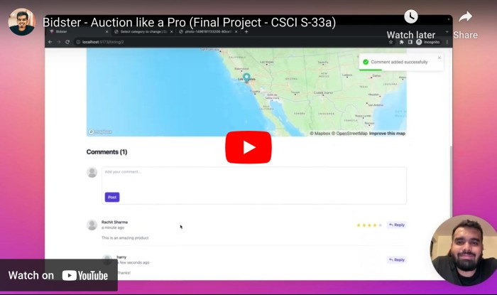](https://www.youtube.com/watch?v=5Nzh2EZi-g8)

[View on YouTube](https://www.youtube.com/watch?v=5Nzh2EZi-g8)

### Overview

Bidster is an auction site where users can create listings for auctioning items. Users can bid on listings, comment on listings, add listings to their watchlist, rate listings and close listings. Users can also view listings on a map. The description can be generated using GPT-3. The description is generated using the title and category of the listing. The site is mobile responsive and works well on mobile devices.

### How to run

#### Frontend:

[Frontend README](client/README.md)

#### Backend:

[Backend README](server/README.md)

Once the client & server is running, visit http://localhost:5173/ in your web browser to view the site.

### Features

#### 1. Mobile Responsive

The site is mobile responsive and works well on mobile devices.

#### 2. Register

Users can register for an account using their email address, username and password. There are validations on the frontend and backend to ensure that the email address and username are unique and that the password is at least 8 characters long. Password and Confirm Password fields are also validated to ensure that they match.

#### 3. Login

Users can login to their account using their username and password. There are validations on the frontend and backend to ensure that the email address and password are correct.

#### 4. Logout

Users can logout of their account from the top navigation bar.

#### 5. Create Listing

- Users can create a listing by providing a title, description, image, category, starting bid and location.
- There are validations on the frontend and backend to ensure that the starting bid is greater than 0.
- The category is selected from a dropdown menu (you can create new category from the dropdown itself) and the location is selected from a map.
- The map is powered by Mapbox. The location is stored as a latitude and longitude and is optional.
- You can search for image as well using Unsplash Source URL.
- The description can be generated using GPT-3. The description is generated using the title and category of the listing. The description is generated on the backend and is not stored in the database.
- After you create a listing, you are redirected to the active listings page.

#### 6. Edit Listing

Users can edit their listing in the same way as they create a listing. The only difference is that the fields are pre-filled with the existing values. You cannot change your starting bid once you have created the listing. After you edit a listing, you are redirected to the listing detail page.

#### 7. Close Listing

Users can close their listing. Once a listing is closed, no more bids can be placed on the listing. The listing is marked as closed and the user who placed the highest bid is marked as the winner. The listing is then moved from the active listings page to the closed listings page. The listing is also removed from the map. After you close a listing, you are redirected to the listing detail page.

#### 8. Place Bid

Users can place a bid on a listing. There are validations on the frontend and backend to ensure that the bid is greater than the current highest bid and that the bid is greater than the starting bid. After you place a bid, you are redirected to the listing detail page. You cannot place a bid on your own listing.

#### 9. Comment

- Users can comment on a listing.
- There are validations on the frontend and backend to ensure that the comment is not empty.
- After you comment on a listing, you are redirected to the listing detail page.
- If you are the winner or the owner of the listing, the comment is marked as a special comment.
- You can click on the name of the user who posted the comment to view their listings.
- There is pagination on the comments. You can view 10 comments at a time.
- You can click on the page numbers to view more comments.

#### 10. Add Comment Reply

Users can add a reply to a comment and same functionality as comment. It is a recursive comment system.

#### 11. Add Listing to Watchlist

Users can add a listing to their watchlist by clicking on the heart button on the listing detail page. After you add a listing to your watchlist, you are redirected to the listing detail page. You can remove a listing from your watchlist by clicking on the heart button on the listing detail page. You can view your watchlist by clicking on the watchlist link in the top navigation bar. You cannot add your own listing to your watchlist.

#### 12. View Watchlist

Users can view their watchlist by clicking on the watchlist link in the top navigation bar. You can filter your watchlist by all, active, closed and won.

#### 13. View Listing / Listing Detail Page

  - Users can view a listing by clicking on the listing title on the listings page.
  - You can view the listing title, description, image, category, current highest bid, number of bids, location, owner, winner, comments and comment replies.
  - You can also view the listing on the map.
  - You can view the owner's listings by clicking on the owner's name.
  - You can place a bid on the listing by entering your bid in the bid input field and clicking on the place bid button.
  - You can comment on the listing by entering your comment in the comment input field and clicking on the comment button.
  - You can add a listing to your watchlist by clicking on the heart button.
  - You can remove a listing from your watchlist by clicking on the heart button.
  - You can close the listing by clicking on the close listing button.
  - You can edit the listing by clicking on the edit listing button.
  - The location is displayed on the map using Mapbox. By default it shows inaccurate location, execpt to the owner and winner of the listing. You can click on the category to view all listings in that category.
  - You can click on the owner's name to view the owner's listings.
  - You can rate the listing by clicking on the stars.
  - You cannot rate or watch your own listing.

#### 14. View User Listings

Users can view their listings by clicking on the user listings link in the top navigation bar. You can filter your listings by all, active, closed.

#### 15. Rate Listing

Users can rate a listing by clicking on the stars on the listing detail page. You can rate a listing only once. You cannot rate your own listing.

#### 16. Filter Listings

Users can filter listings by all, active, closed, won, my, watchlist. You can filter listings on the listings page, category page, all categories page, watchlist page and user listings page.

#### 17. Search Listings

Users can search listings by title. You can search listings on the listings page, category page, all categories page, watchlist page and user listings page.

#### 18. View Listings on Map

Users can view listings on the map view. It displays all the active listings on the map. You can click on the listing to view the listing detail page. The locations are not accurate, except to the owner and winner of the listing.

#### 19. View Category Listings

Users can view categories by clicking on the category link in the top navigation bar. You can click on the category to view all listings in that category.

#### 20. View All Categories

Users can view all categories by clicking on the all categories link in the top navigation bar. You can click on the category to view all listings in that category. It shows the number of active listings in each category.

### Models Used

- User
- Listing
- Bid
- Comment
- Watchlist
- Category
- Rating

### Technologies Used

- Django
- Django Rest Framework
- React
- Tailwind CSS
- Vite
- Mapbox
- OpenAI GPT-3
### Screenshots

#### Login Page

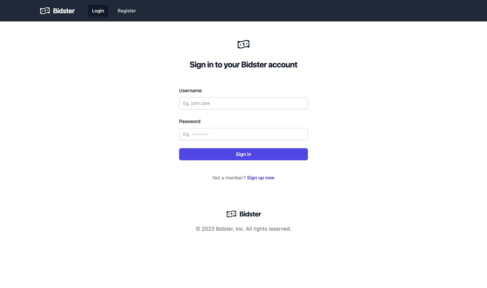

#### Register Page

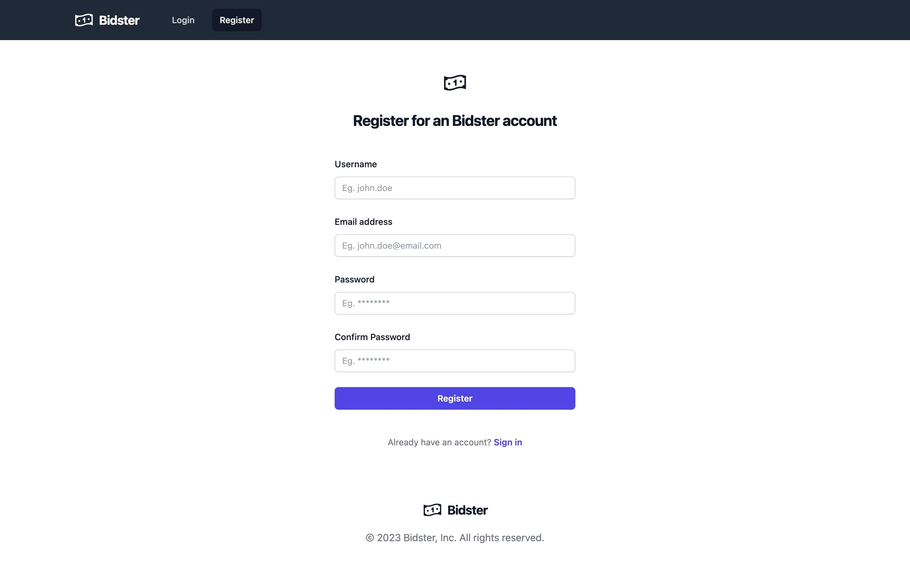

#### Home Page/All Listings Page

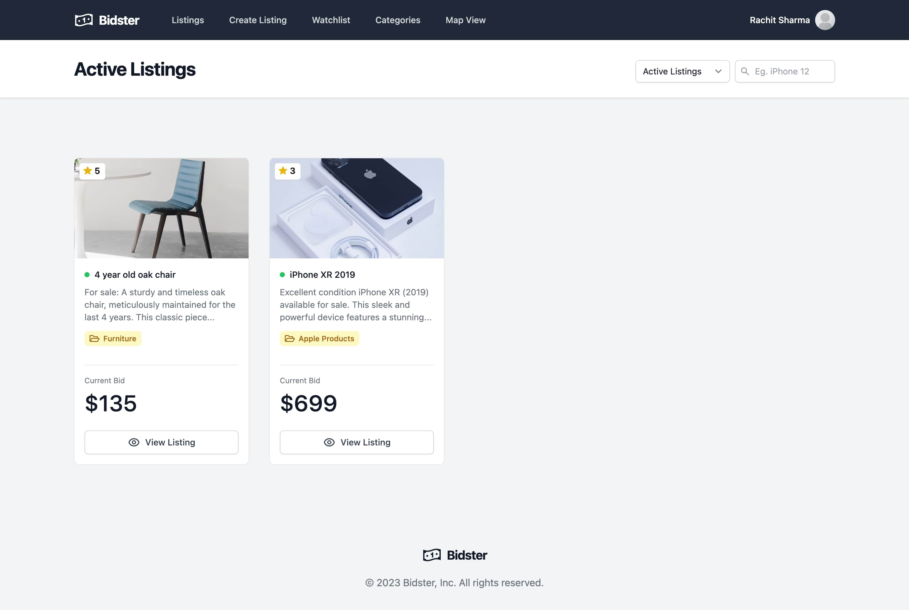

#### Listing Detail Page

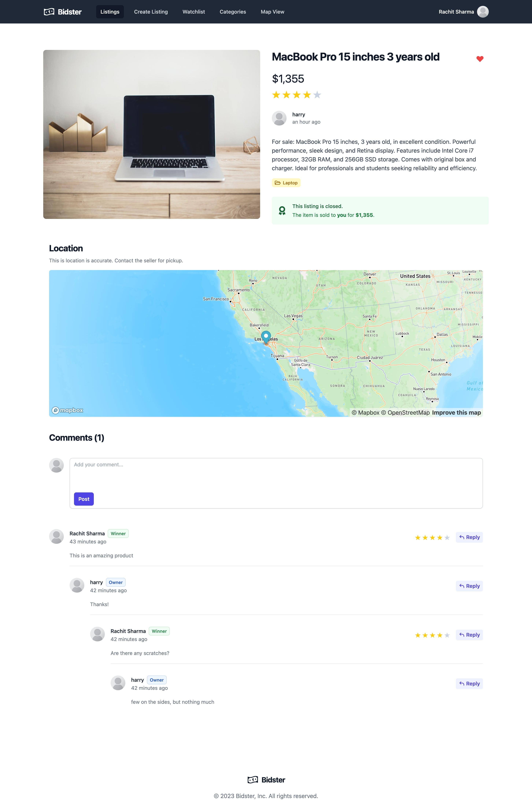

#### Category Page

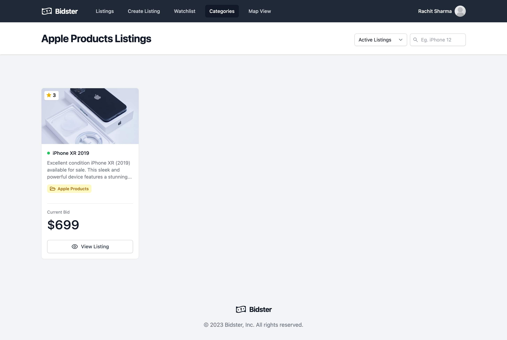

#### All Categories Page

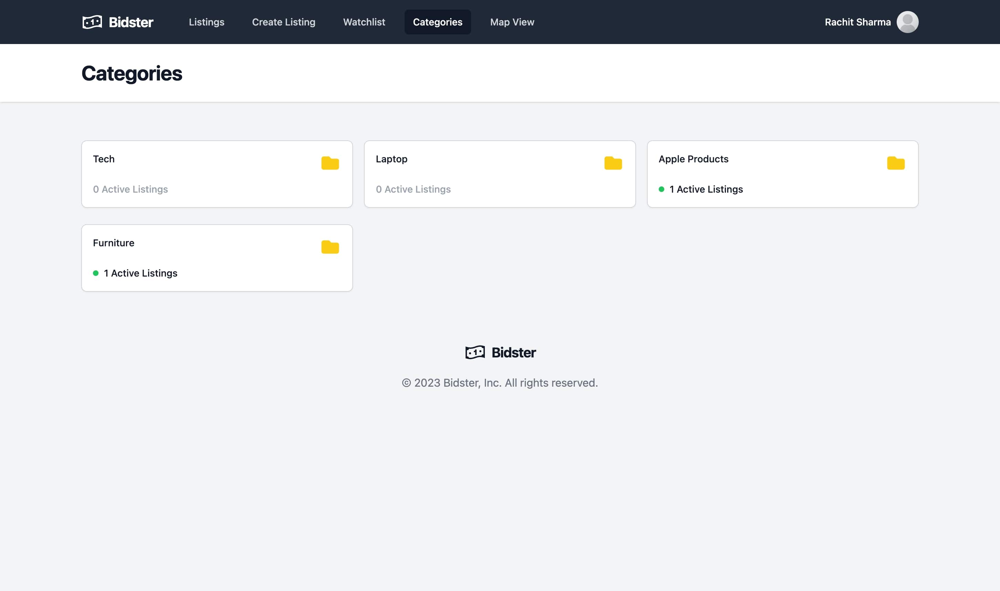

#### Watchlist Page

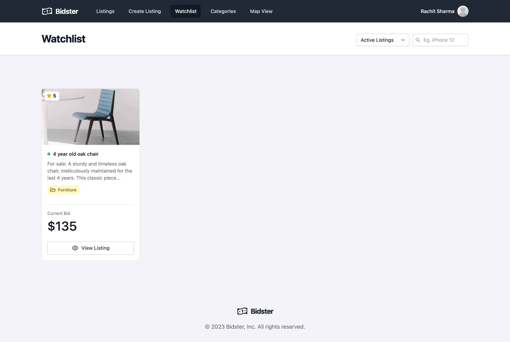

#### User Listings Page

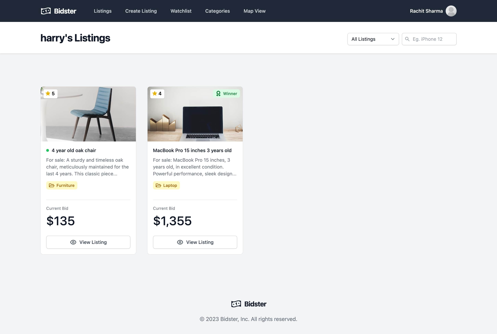

#### Create Listing Page

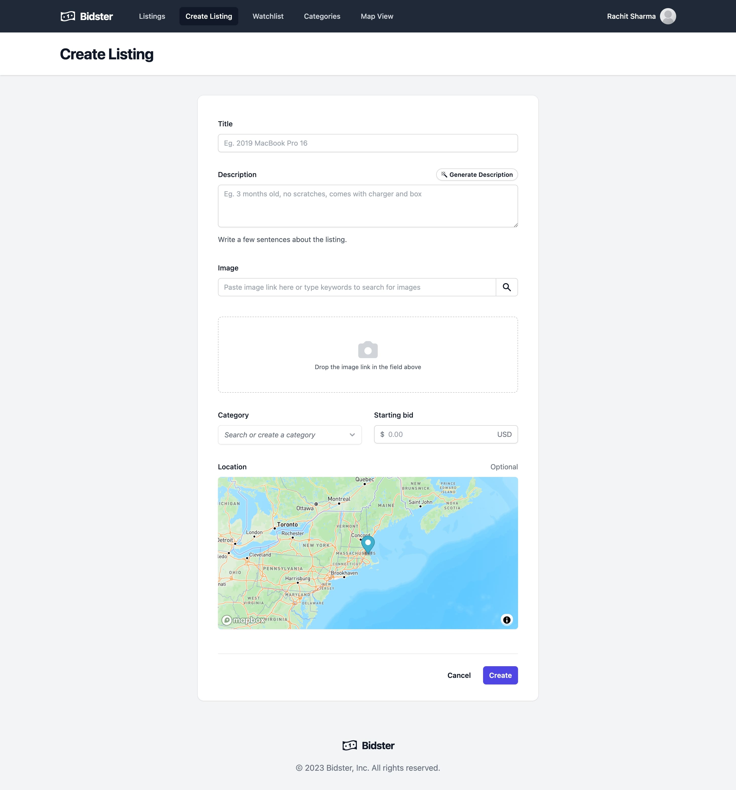

#### Edit Listing Page

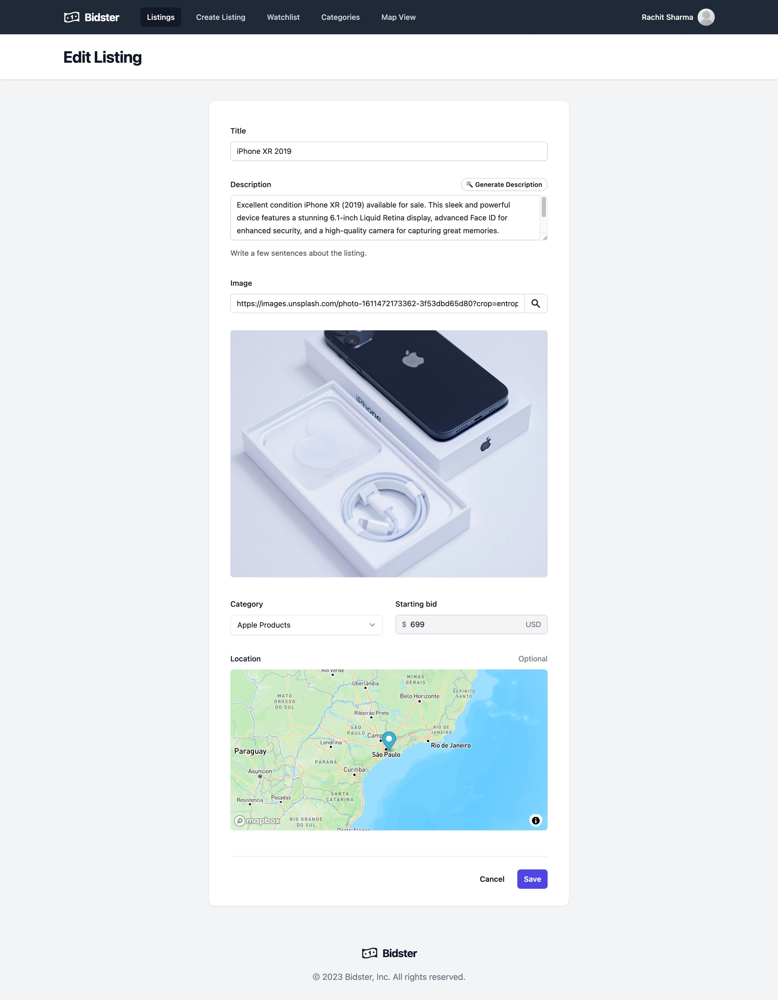

#### Map Page

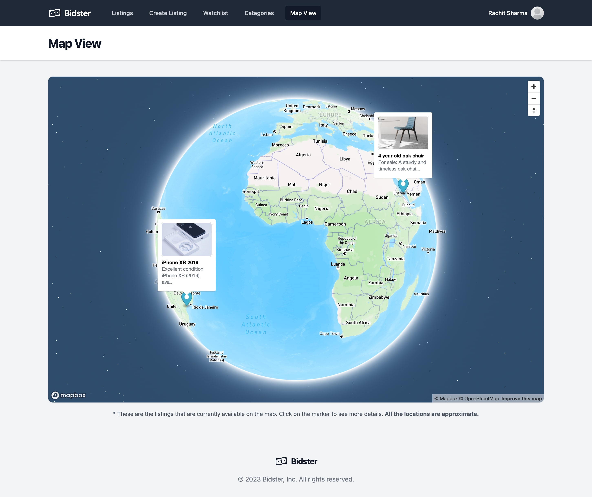

### Credits

- [Django](https://www.djangoproject.com/)
- [Django Rest Framework](https://www.django-rest-framework.org/)
- [React](https://reactjs.org/)
- [Tailwind CSS](https://tailwindcss.com/)
- [Vite](https://vitejs.dev/)
- [Mapbox](https://www.mapbox.com/)

### License

[MIT](LICENSE)

